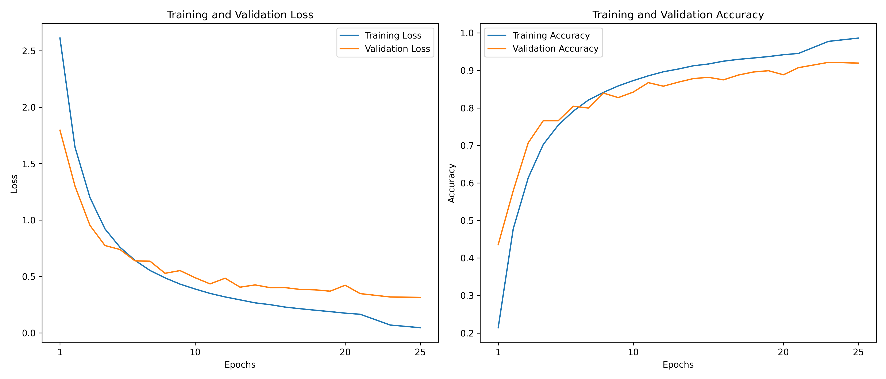
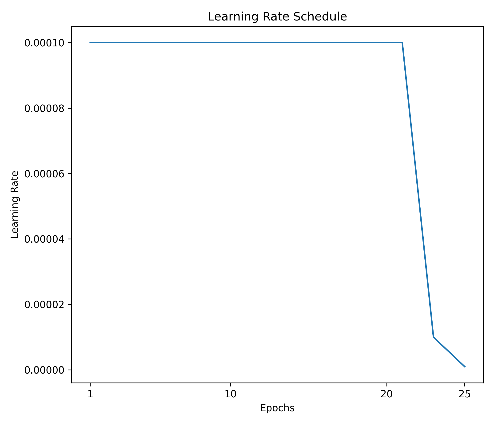

# Jester-TimeSformer
Implementation of the TimeSformer architecture for hand gesture recognition using the Jester dataset, built with PyTorch.

**Key terms: distributed training, DDP, divided attention (temporal and spatial), patch embeddings, multi-head self-attention, gradient checkpointing, mixed precision training, learning rate scheduling, early stopping.**

Training utilized **distributed data parallel (DDP)** across multiple GPUs with synchronized batch normalization and mixed precision training.

## Dataset:
**20BN-Jester Dataset:** A large-scale video dataset for hand gesture recognition, containing 27 classes of common gestures. Training is performed on 16-frame sequences, with frames resized to 224x224 pixels.

## Model:
The implementation follows the TimeSformer (Time-Space Transformer) architecture with:
- **Patch embedding** layer that divides each frame into 16x16 patches
- **Separate temporal and spatial attention** mechanisms in each transformer block
- Architecture specifications:
  - Embedding dimension: 384
  - Number of transformer layers: 8
  - Number of attention heads: 6
  - MLP expansion ratio: 4.0
  - Dropout rates: 0.1 for both attention and general dropout
  - Learnable temporal and spatial position embeddings

The total number of trainable parameters is 19,321,371.

## Training:
- **Distributed training** across multiple GPUs using PyTorch DDP
- **Mixed precision training** with gradient scaling
- **AdamW optimizer** with weight decay of 0.05
- **Cross-entropy loss** with label smoothing of 0.1
- **ReduceLROnPlateau scheduler** with factor 0.1 and patience of 5 epochs
- **Early stopping** with patience of 10 epochs
- Batch size of 16 per GPU
- Frame stride of 2 for temporal sampling

## Performance:
Best model checkpoint results (epoch 23):
- Training Loss: 0.0455, Training Accuracy: 98.62%
- Validation Loss: 0.3450, Validation Accuracy: 91.56%

The model achieves 92% accuracy on the Jester dataset, demonstrating the effectiveness of divided attention mechanisms for video understanding tasks.

